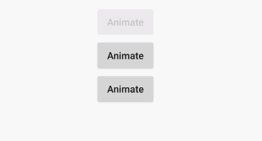
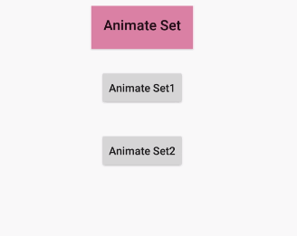
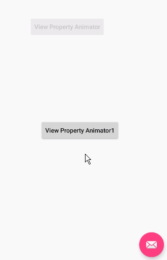
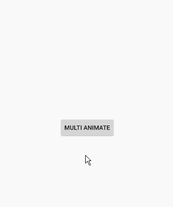
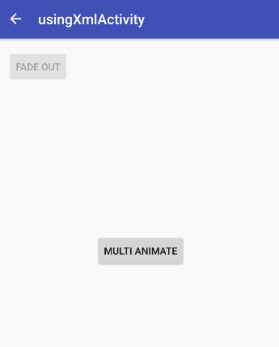
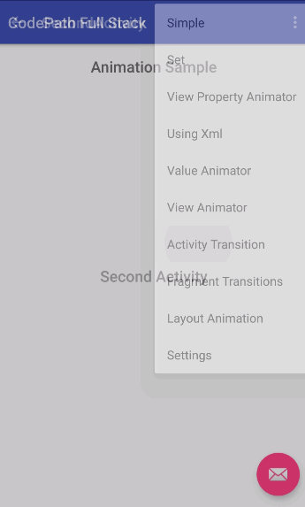
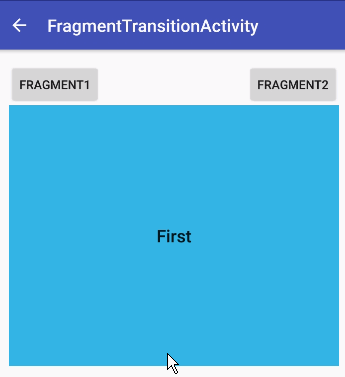
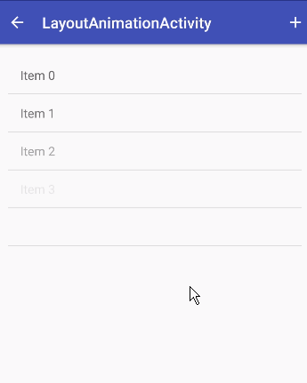

# Animations
示例效果图。

## 1. Property Animator

### 1.1 Using ObjectAnimator in Java



### 1.2 Choreographing Animations



### 1.3 Using ViewPropertyAnimator in Java



### 1.4 Using XML



### 1.5 Custom Animations with ValueAnimator

```
03-08 22:58:32.232 19058-19058/com.aaron.codepathfullstack D/ValueAnimatorActivity: value is 1.0
03-08 22:58:32.245 19058-19058/com.aaron.codepathfullstack D/ValueAnimatorActivity: value is 1.0
03-08 22:58:32.261 19058-19058/com.aaron.codepathfullstack D/ValueAnimatorActivity: value is 0.96825606
03-08 22:58:32.278 19058-19058/com.aaron.codepathfullstack D/ValueAnimatorActivity: value is 0.935089
03-08 22:58:32.294 19058-19058/com.aaron.codepathfullstack D/ValueAnimatorActivity: value is 0.9025
03-08 22:58:32.311 19058-19058/com.aaron.codepathfullstack D/ValueAnimatorActivity: value is 0.87235606
03-08 22:58:32.329 19058-19058/com.aaron.codepathfullstack D/ValueAnimatorActivity: value is 0.840889
03-08 22:58:32.345 19058-19058/com.aaron.codepathfullstack D/ValueAnimatorActivity: value is 0.80999994
03-08 22:58:32.362 19058-19058/com.aaron.codepathfullstack D/ValueAnimatorActivity: value is 0.779689
......
```

## 2. View Animations

### 2.1 Using XML



### 2.2 Activity Transitions



### 2.3 Modifying the Default Transitions

### 2.4 Fragment Transitions



### 2.5 Layout Animations


