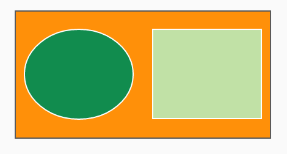
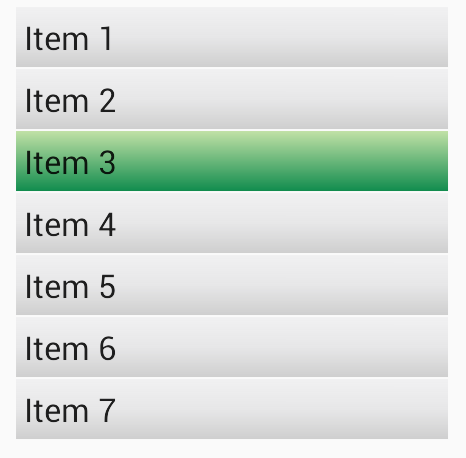

# Drawables

## 效果图概览
### 0. Solid Color Shapes

### 1. Gradient Colored Shapes

### 2. Radial-type gradients

### 3.  State List

 

### 4.  Layer List Drawable

### 5.  Customizing a ListView

## 参考

- [CodePath Android Guides Drawables](https://github.com/codepath/android_guides/wiki/Drawables)
- [Drawable Resources](http://developer.android.com/guide/topics/resources/drawable-resource.html)
